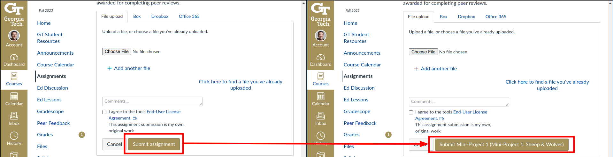

# Note: the main feature of this extension (button renaming) and more (PDF preview) is now included in a better extension that Ansh Sikka made and published: https://chrome.google.com/webstore/detail/canvas-pre-submission-pre/micpkocdgpegjoejbjbkfagipgmbonkc
I'll leave this repo up for posterity.

# Assignment Button Renamer for Gatech OMSCS

## Introduction

This Chrome extension is designed to assist Gatech OMSCS (Online Master of Science in Computer Science) students. The primary goal is to reduce the likelihood of submitting assignments to the wrong page.

## Problem Statement

It is not uncommon for students to accidentally submit their work for assignment A on the submission page for assignment B. Such mistakes can cause unnecessary stress and may require time-consuming corrections.

## Solution

This extension automatically renames the submission button to include the assignment name, making it easier to identify which assignment you are submitting to. Below is how the renamed button looks:

## Installation

### Installing in Chrome Developer Mode

1. **Download the Repository**: Clone or download this repository to your local machine.
2. **Open Chrome Extensions Page**: Open your Google Chrome browser and go to `chrome://extensions/`.
3. **Enable Developer Mode**: Turn on the "Developer mode" toggle located at the top right corner of the extensions page.
4. **Load Unpacked Extension**: Click on the "Load unpacked" button, and select the directory where you downloaded this repository.
5. **Check Installation**: Navigate to a Gatech OMSCS course assignment page to see the extension in action.

By following these instructions, the extension should be installed and operational on your Google Chrome browser.
